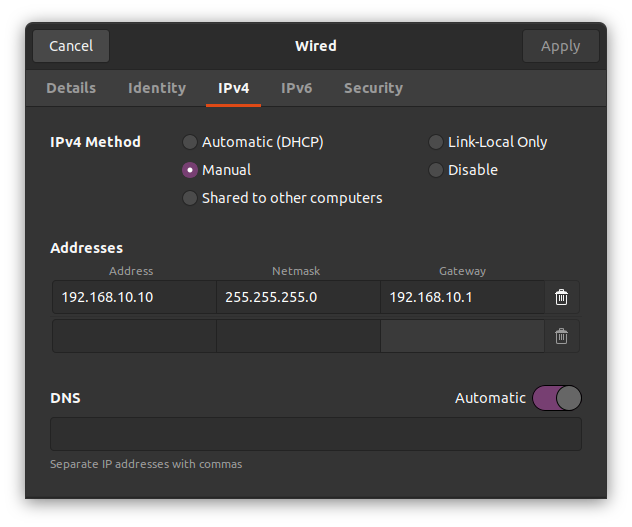
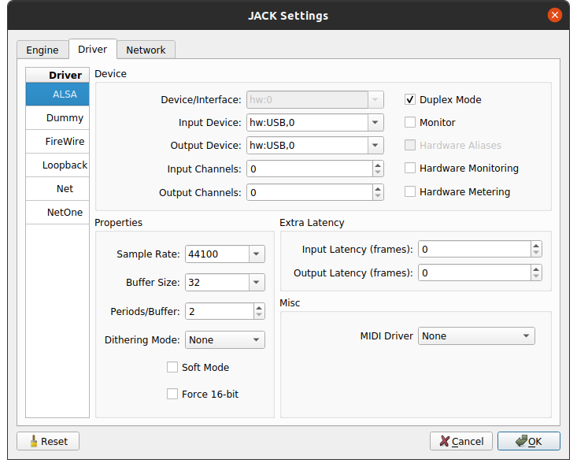
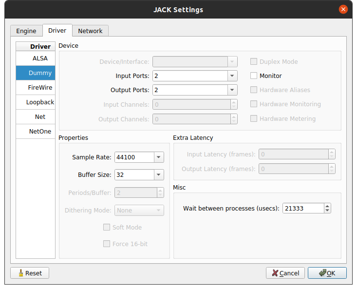
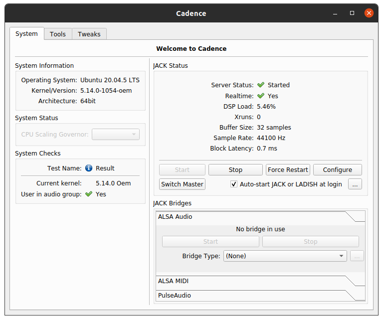
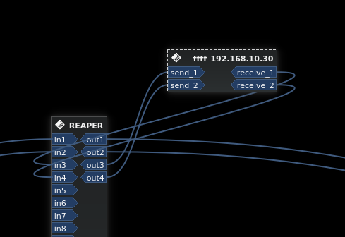

# Teensy JackTripClient

A JackTrip client for the Teensy audio library.

JackTripClient inherits from EthernetUDP; there's no need to start ethernet or 
UDP separately.

```c++
// main.cpp
JackTripClient jtc{numJackTripChannels, serverIP};
AudioOutputI2S out;

AudioConnection patchCord1(jtc, 0, out, 0);
// etc.

void setup() {
    // Start ethernet, open a UDP port.
    jtc.begin(udpPort);
    //...
}

void loop() {
    // Try to connect to a JackTrip server.
    if (!jtc.isConnected()) {
       jtc.connect(2500);
    }
}
```

## Setup/Tools

Hardware prerequisites:
- A Teensy 4.1 equipped with audio and ethernet shields

Software:
- [JACK](https://jackaudio.org/)
- [JackTrip](https://jacktrip.github.io/jacktrip/)

In addition to the installation instructions at those links, there's a friendly,
high-level [guide](https://ccrma.stanford.edu/docs/common/IETF.html) 
to running JACK and JackTrip on the CCRMA website. 

### JACK

JackTrip uses JACK as its audio server.
```shell
sudo apt install jackd2
```
Or head to the [downloads](https://jackaudio.org/downloads/) page and choose
your poison.

### JackTrip

The version on `apt` is calamitously out-of-date; fortunately there are 
detailed, cross-platform, installation instructions
[here](https://jacktrip.github.io/jacktrip/Build/Linux/).

JackTrip is QT-based; it may be necessary to install QT's websockets module:

```shell
sudo apt install libqt5websockets5-dev
```

And, if you want to use the GUI JackTrip app:

```shell
sudo apt install qml-module-qtquick-controls2
```

### QJackCtl / Cadence

You might get on just fine with 
[QJackCtl](https://qjackctl.sourceforge.io/qjackctl-index.html#Installation)
as an interface to JACK.
[Cadence](https://kx.studio/Applications:Cadence) potentially offers a better
experience if you need to connect to an external audio interface (perhaps
because it's not possible to change the sampling rate of your built-in audio
card). Install Cadence as per the 
[instructions](https://github.com/falkTX/Cadence/blob/master/INSTALL.md);
once installed, the tools _Catia_ and _Logs_ are very useful.

### Teensy

[TyTools](https://github.com/Koromix/tytools) are nice for working with
multiple Teensies.

### PlatformIO

PlatformIO offers more flexibility than the Arduino/Teensyduino IDE, such as
multiple configuration environments, easily setting build flags, etc.

On Linux, install the udev rules provided by 
[platformIO](https://docs.platformio.org/en/latest/core/installation/udev-rules.html)
or [Teensy](https://www.pjrc.com/teensy/loader_linux.html).

`platformio.ini` defines `AUDIO_BLOCK_SAMPLES` which sets Teensy's audio block
size, which, like the sample rate, must match that used by the machine running
the JackTrip server.

It _also_ specifies that the GUI Teensy Loader should be used for uploading.
The CLI version behaves weirdly; it tends to need two runs for the upload
process to work. The GUI app seems to get the job done more reliably. You may, 
however, see the following at the end of the output for `pio run`:
```shell
...
Uploading .pio/build/teensy41/firmware.hex
Hangup
*** [upload] Error 129
```
If, however, Teensy Loader shows a "Programming" modal with a progress bar, 
all should be well.

There's also a script, `scripts/upload.sh` that uses TyTools to automate
building and uploading to multiple Teensies, e.g. to upload the WFS sketch to
all connected Teensies:

```shell
./scrips/upload wfs
```

### Ethernet

The wired connection on the machine running the JackTrip server should be
set to manual IPv4 mode (i.e. DHCP disabled), with **subnet mask** 
`255.255.255.0`, **address** matching `jackTripServerIP` as specified in 
`main.cpp`, and **gateway** `x.x.x.1` (where `x` are the first three octets of 
**address**).

If in doubt, try something like:

- subnet mask: `255.255.255.0`
- gateway: `192.168.10.1`
- address: `192.168.10.10`



## More detail on usage

Bearing in mind the number of moving parts, usage can be a little complicated.

Connect a computer to an ethernet switch. Teens(y|ies), running this program,
with ethernet shield connected, should be attached, by an ethernet cable, to the
switch.

If you're using an external audio interface, connect it. Open Cadence, click 
_Configure_, navigate to _Driver_, and select the appropriate _Output Device_
(probably something like "hw:USB,0 [USB Audio]"). Select the sample rate that
matches the value being sent with each JackTrip UDP packet, as specified in
[JackTripClient.h](src/JackTripClient.h).



Alternatively run a dummy driver with sample rate and buffer size of your 
choosing.



Verify, either via Cadence or QJackCtl that Jack is running, and 
doing so at the desired sample rate/buffer size.



Start JackTrip on the computer in hub server mode (`-S`). In the interests of
minimising latency, set the queue buffer length (`-q`) to 2 (rather than the
default, 4). Specify the patching mode (`-p5`, no autopatching) and 
instruct JackTrip to report diagnostic info every 5 seconds (`-I5`).
Additionally, set the number of IO channels (`-n`) with, e.g.
```shell
jacktrip -S -q2 -p5 -I5 -n8
```

If the Teensy sketch has `WAIT_FOR_SERIAL` defined, the program will wait for a
serial connection. Open a serial connection with 
`pio device monitor -p /dev/ttyACM<N>` and the program will resume.

Play some audio in an application — e.g. Audacity, Reaper — for which it is
possible to select JACK as the output device. Then use QJackCtl or 
Catia (part of the Cadence suite) to route audio from that application to the 
client, i.e. Teensy, which will appear as `__ffff_[clientIP]`.



Audio sent to Teensy over UDP via JACK/JackTrip, can be routed to Teensy's
I<sup>2</sup>S audio output in the usual Teensy Audio Library way, with 
`AudioConnection` instances.

Audio entering the inputs of a `JackTripClient` instance will be sent back to
the server over UDP.

The client is resilient to the changing state of the server. With a `loop()`
set up as follows:
```c++
JackTripClient jtc;
int timeout{2500};
// setup, etc.
void loop() {
    if (!jtc.isConnected()) {
        jtc.connect(timeout);
    }
}
```
if there's no JackTrip server, the client will poll TCP until a server appears
on the designated IP address and port. Similarly, If the server is shut down or
killed, Teensy will attempt to reconnect.

_NB If JackTrip is stopped and restarted, JackTripWorker may complain about "not 
receiving Datagrams (timeout)". As far as I can tell, JackTrip is indeed
receiving datagrams at this point, but `JackTripWorker::mSpawning` is stuck set
to `true`._

## Clock drift and network jitter

JackTripClient employs a relatively simple strategy for addressing both of these
issues. Network operations take place on Teensy's audio hardware interrupt.
The client converts incoming UDP packets to audio and writes the
audio data to a circular buffer with an integer write index and a non-integer
read position.

For clock drift, i.e. the differing audio clock speeds between JackTrip server
and client:
- Every 1000 packets received from the server, check how many packets were sent
during the same period;
- Use the received:sent ratio to set the read position increment;
  - e.g. if 999 packets were sent for 1000 received, the client is falling 
behind, so set a read position increment of `1000/999 ~= 1.001`;
  - e.g. if 1001 packets were sent for 1000 received, the server is running 
slow, so set a read position increment of `999/1000 = .999`.

This strategy should, over the long term, keep the read position at a steady 
offset behind the write index. 

Network jitter, by comparison, is a short-term phenomenon whereby packets
may not arrive at regular intervals. For a given interrupt, the client may
find that no packets are available; at the next iteration there may be two
packets available, etc. This may occur cyclically over time (probably 
related to long-term clock drift), and it may also be encountered suddenly
due to, e.g. the server prioritising operations besides audio and/or network
functionality (e.g. try unplugging a laptop running as your JackTrip server, and 
plugging it back in, or opening VS Code...).

The client keeps track of the delta between the write index and the read 
position:
- If the delta exceeds an arbitrary (well, *tuned*) high threshold, increase the
read position increment until the data no longer exceeds that threshold;
  - do so by a factor of `rwDelta / highThreshold`;
- if the delta falls below a low threshold, reduce the read position increment;
  - do so by a factor of `rwDelta / lowThreshold`;

Under such a strategy, the write index and read position should never overlap.
Under catastrophic jitter conditions, however, the write index may stop 
advancing altogether, at 
which point the read position will also come to a halt, which may or may not 
sound as bad as allowing an overlap to occur.

In any case, the problem reduces to one of tolerances in terms of latency,
inter-client synchronicity and the perceptual impact of fluctuations in the 
read position increment on the audio signal being represented. Set a
low lower read-write delta threshold with the aim of minimising server-client
latency, and one increases the risk of the read position colliding with the 
write index Set too narrow an interval between low and high read-write delta 
thresholds, with the aim of optimising inter-client synchronicity, and it is 
inevitable, during periods of network jitter, that the read position increment 
will fluctuate wildly enough to introduce audible artifacts to the output 
signal.

Write index and read position increments happen by packet-sized chunks, whose
large steps may give rise to the sort of rapid increment fluctuations described
above. 
There may be a more sophisticated strategy, whereby input and output are handled
concurrently; one for future work.

## Examples

A couple of basic examples can be found here. There is also a Wave Field 
Synthesis example at [https://github.com/hatchjaw/teensy-wfs]().

## Notes

- A TCP handshake is used to exchange UDP ports between client and server.
  - Client starts to send UDP packets, the server uses the header to initialize
    jack parameters.
  - That's it; it's really simple.
- Sending audio from the server to Teensy, and back to the server, results in
  occasional dropouts; These appear to be delays, either in Teensy sending a
  UDP buffer, or in the JackTripServer receiving it.
- Maximum undistorted level for the audio shield's headphone output is 0.8. 
  Sending anything hotter than that (and back into an audio interface) results
  in a mangling of the signal. Something like modularity applied to sample 
  values; it's weird.
- JackTrip's UdpDataProtocol class ultimately derives from QThread. For each
  peer that connects to the server, a new instance of UdpDataProtocol, and
  thus a new thread, is created. JackTrip doesn't support UDP multicast, 
  and this has ramifications for synchronicity when running multiple clients.
- Using a dummy driver it's possible to set a very low buffer size, consequently
  `AUDIO_BLOCK_SAMPLES` can be set as low as 8, with (initial) roundtrip latency
  of ~1.5 ms. 4 samples seems to be too small even for a dummy driver. 8 is a 
  little flaky; 16 can yield round-trip latency of as little as 1.8 ms.
- Things to investigate:
  - `FNET_POLL_TIME` in NativeEthernet.h
  - revisit the [QNEthernet](https://github.com/ssilverman/QNEthernet) project,
which promises better command of the incoming UDP packet queue, but proved to be
too 
  - Nudging Teensy's PLL may be useful counterpart to the solution implemented
for counteracting clock drift and network jitter.