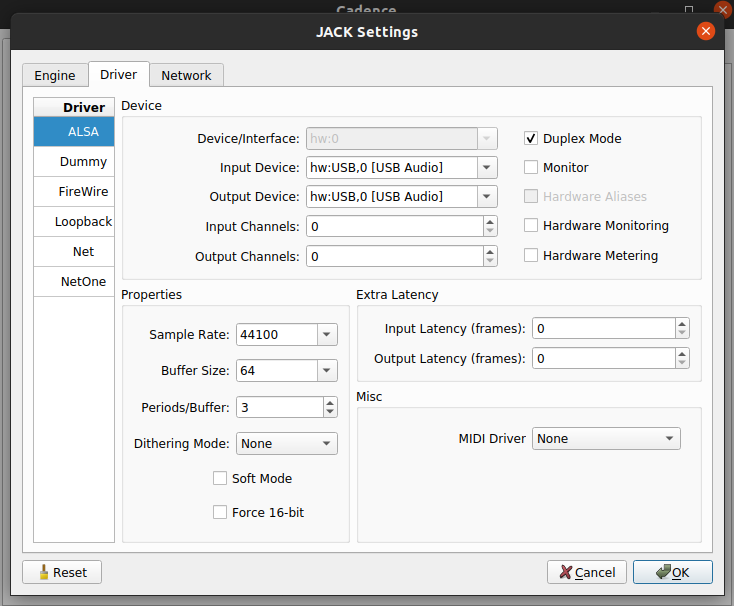
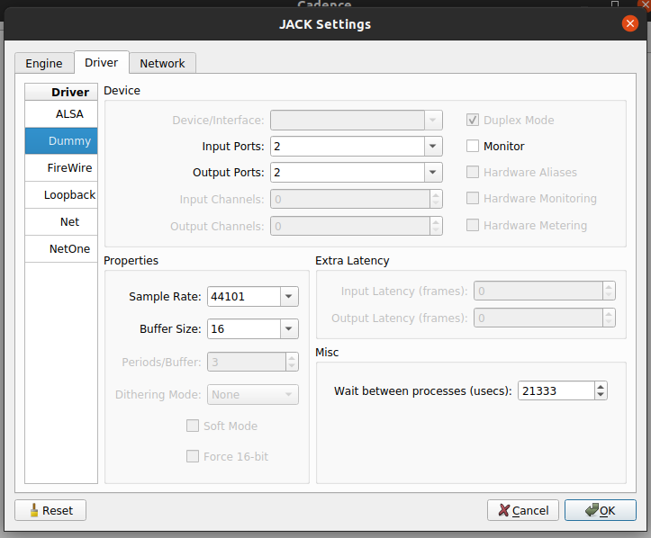
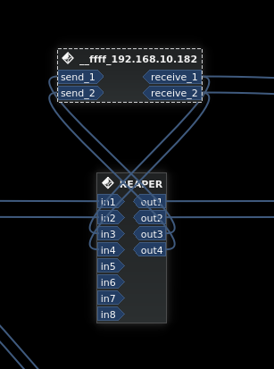
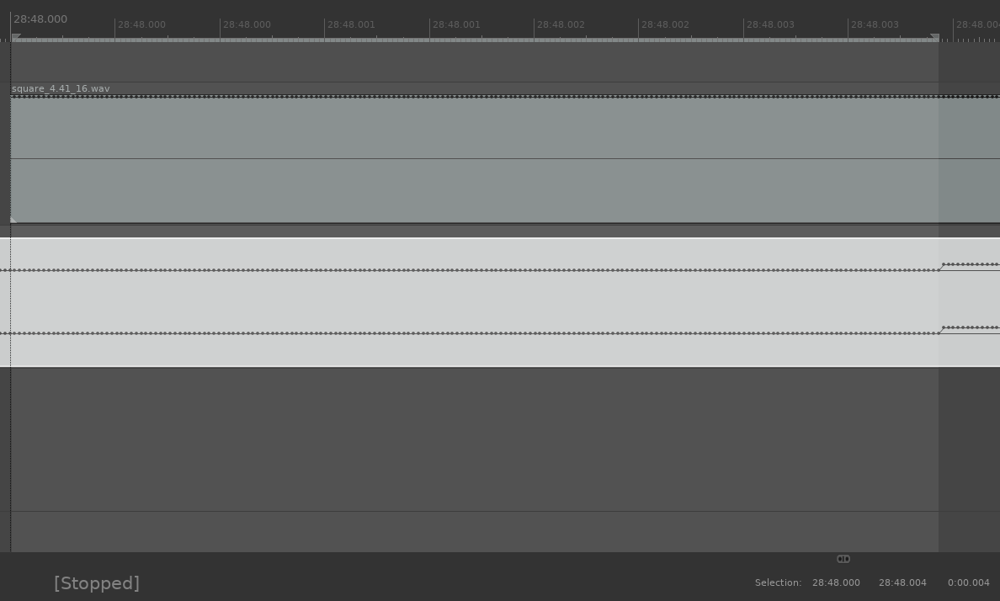
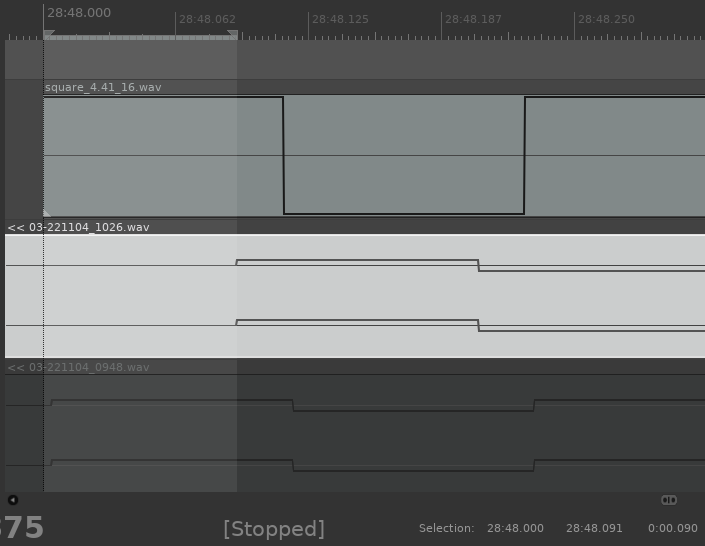
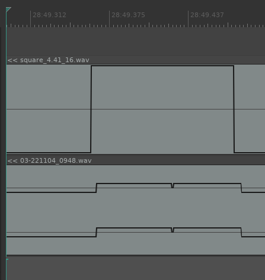
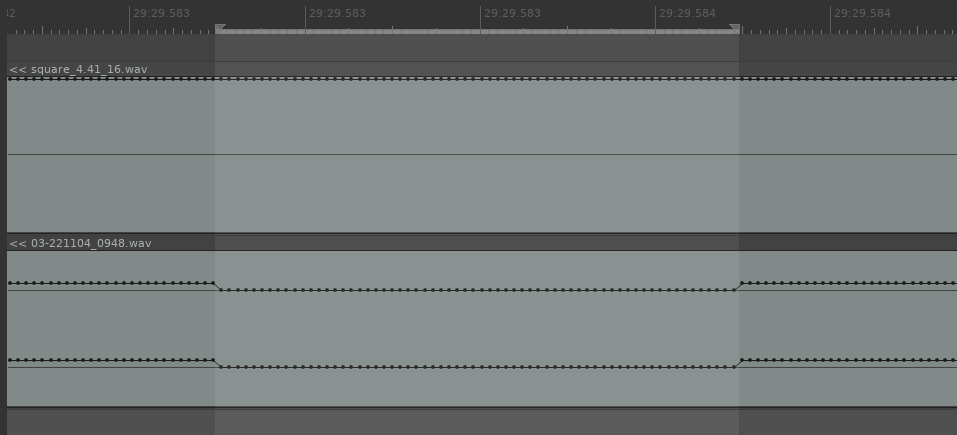

# Notes

## JACK Settings

### ALSA driver

With interface Focusrite Scarlett 2i2

Any lower than 64/3 doesn't work.

### Dummy driver

Note Fs set to 44101 Hz as a means to experiment with clock-drift issues.
JackTrip accepts sampling rates from an enumerated list
of standard rates (32, 44.1, 48 KHz etc.), but accepts Fs +/- 100 Hz.

## Routing

Reaper outputs 3/4 routed to Teensy JackTrip client inputs (send_1, send_2).
Teensy JackTrip outputs (receive_1, receive_2) routed to Reaper inputs 3/4.

## Round-trip latency

Server running at 44.1/64 using ALSA driver and hardware interface.
Reaper playing 4.41 Hz square wave (top track).
Reaper recording inputs 3/4 from Teensy JTC (bottom track).

Latency ~4 ms

Detail:

### Increase over time

Another recording taken ~38 minutes later:

Latency is now ~90 ms

## Packet loss

Server running at 44.1/64 using ALSA driver and hardware interface.
Reaper playing 4.41 Hz square wave (top track).
Reaper recording inputs 3/4 from Teensy JTC (bottom track).

Dropout of exactly 64 samples in the round-trip signal.

Detail:

Round-trip latency subsequently increases from ~4 ms to ~5 ms.